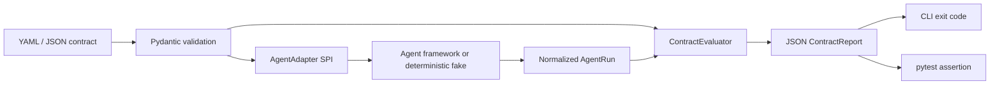
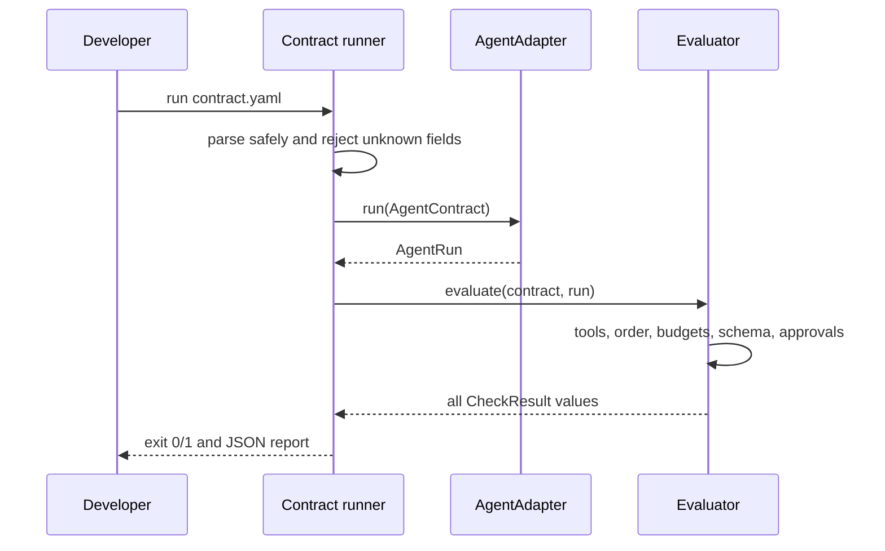

# Agent Contract Test

Agent Contract Test is a framework-neutral behavioral contract and regression testing toolkit for AI agents. It validates tool behavior, execution budgets, structured responses, and approval invariants with deterministic local doubles.

[](https://github.com/aniket-deshkar/agent-contract-test/actions/workflows/ci.yml)
[](LICENSE)

## Problem Statement

Agent tests often prove only that some response exists or compare exact prose. Those checks miss the behavior that matters: which tools ran, with what arguments, in what required order, under which approvals, and within which execution budget. Exact-text assertions also fail when a harmless wording change occurs.

## What This Project Solves

This package defines a versioned YAML/JSON contract and evaluates a normalized agent transcript. It supports:

- required and forbidden tool calls;
- deep-subset tool argument assertions;
- explicit tool-order subsequences;
- maximum agent steps and model calls;
- token and cost budgets when an adapter supplies usage metadata;
- Draft 2020-12 JSON Schema response validation with format checking;
- per-tool approval-request and approval-result assertions;
- deterministic fake agent and tool implementations;
- stable CLI exit codes and machine-readable JSON reports;
- a Python adapter protocol and pytest fixture.

Normal tests never require a real LLM, network access, or provider credentials.

## When To Use It

Use Agent Contract Test for agent workflows where tools, approval boundaries, structured output, and bounded execution are part of the product contract. It fits unit tests, pull-request regression suites, and cross-framework migrations. It deliberately does not rank model quality or replace a broad prompt-evaluation platform.

## Architecture / HLD



Framework adapters own execution and normalization. The evaluator is synchronous and side-effect free, so identical contracts and transcripts produce identical checks.

## Detailed Design / LLD



Evaluation accumulates every failure rather than stopping at the first one. Repeated required-tool expectations consume distinct observed calls. Tool argument objects use recursive subset matching, while arrays use exact order and length.

## Public API / API Structure

- `AgentContract`, `ContractExpectations`, and expectation models define the contract.
- `AgentRun`, `ToolCall`, and `UsageMetadata` are the adapter output model.
- `AgentAdapter` is the runtime-checkable framework protocol.
- `ContractEvaluator.evaluate()` performs pure transcript evaluation.
- `run_contract()` and `run_contract_file()` return reports.
- `assert_contract()` raises one `ContractViolationError` containing all failures.
- `FakeAgentAdapter`, `FakeTool`, and `FakeToolRegistry` support deterministic tests.
- `load_contract()` and `load_run()` safely load YAML or JSON.

## Core Concepts

### Contract versus adapter

Contracts describe behavior without importing a framework. An adapter receives the validated contract input, invokes a framework-specific agent, and returns the portable `AgentRun` transcript.

### Required tool arguments

Object arguments are deep-subset matched. A contract can require security-relevant fields without coupling itself to harmless adapter metadata. Arrays remain exact because reordering or adding array elements can change meaning.

### Tool order

`tool_order` is an ordered subsequence. Unlisted calls may occur between named calls, but every listed tool must appear in the declared order.

### Usage metadata

Step and model-call counters are mandatory transcript fields. Token and cost values are optional because not every provider reports them. Configured token/cost checks are recorded as not evaluated—and do not fail—when metadata is unavailable.

### Approvals

Approval expectations apply to every observed call of the named tool. They can require or forbid an approval request and can assert whether approval was granted. An approval expectation fails if its tool was never observed.

## Local Prerequisites

- Python 3.11 or newer
- Git

No database, container runtime, paid API, or real model is required.

## Steps To Run

Create an isolated environment and install development dependencies:

```bash
python -m venv .venv
```

Windows PowerShell:

```powershell
.\.venv\Scripts\python.exe -m pip install -e ".[dev]"
.\.venv\Scripts\ruff.exe format --check .
.\.venv\Scripts\ruff.exe check .
.\.venv\Scripts\pytest.exe
```

Linux or macOS:

```bash
.venv/bin/python -m pip install -e ".[dev]"
.venv/bin/ruff format --check .
.venv/bin/ruff check .
.venv/bin/pytest
```

## Configuration

Contracts use schema version `"1"` and reject unknown fields:

```yaml
version: "1"
name: inventory-before-order
input:
  customer_id: customer-7
  sku: book-42
expect:
  required_tool_calls:
    - name: check_inventory
      arguments:
        sku: book-42
    - name: create_order
  forbidden_tool_calls: [issue_refund]
  tool_order: [check_inventory, create_order]
  max_agent_steps: 4
  max_model_calls: 2
  max_tokens: 500
  max_cost: 0.01
  approvals:
    - tool: create_order
      required: true
      granted: true
  response_schema:
    type: object
    required: [order_id]
    properties:
      order_id: {type: string, minLength: 1}
```

## Usage Examples

### CLI with a deterministic run fixture

```bash
agent-contract-test run examples/order-contract.yaml \
  --run-fixture examples/passing-run.json \
  --report artifacts/contract-report.json
```

The command prints the report to standard output and optionally writes the same JSON to disk. Exit `0` means pass, `1` means contract failure, and `2` means invalid configuration or input.

### CLI with a framework adapter

```bash
actest run examples/order-contract.yaml \
  --adapter examples.fake_adapter:create_adapter
```

The referenced attribute may be an adapter instance or a zero-argument factory returning an object with `run(contract) -> AgentRun`.

### Python and pytest

```python
from agent_contract_test import assert_contract, load_contract


def test_order_agent(contract_runner, order_agent_adapter):
    contract = load_contract("contracts/order.yaml")
    report = contract_runner(contract, order_agent_adapter)
    assert report.run.model_calls <= 2
```

The `contract_runner` fixture is registered automatically through the package's `pytest11` entry point. Direct `assert_contract(contract, adapter)` usage is equivalent.

### Minimal adapter

```python
from agent_contract_test import AgentRun, ToolCall


class MyAgentAdapter:
    def run(self, contract):
        result = my_agent.invoke(contract.input)
        return AgentRun(
            response=result.output,
            tool_calls=[
                ToolCall(name=call.name, arguments=call.arguments) for call in result.tool_calls
            ],
            agent_steps=result.steps,
            model_calls=result.model_calls,
        )
```

## Testing

The repository tests passing and failing tool assertions, nested arguments, repeated calls, order, all budget types, missing usage metadata, valid and invalid JSON Schemas, approvals, strict YAML/JSON loading, deterministic fake isolation, complete pytest failure messages, CLI reports, and exit codes.

Run `pytest` for the suite. CI also runs `ruff format --check`, `ruff check`, and builds both wheel and source distributions on Python 3.11 and 3.14.

## Observability

`ContractReport` is the observability boundary. It includes schema version, contract name, overall status, every stable check code, human-readable messages, structured details, the normalized run, and a UTC generation timestamp. CI systems can archive the JSON report without parsing console prose.

The package emits no telemetry and sends no data externally.

## Security

YAML uses `safe_load`; Python object constructors are not accepted. Contract models reject unknown fields to surface misspellings. Adapter references import local Python code and must therefore be treated as executable configuration from a trusted repository. Reports may contain tool arguments, responses, and provider metadata, so redact secrets in adapters and protect report artifacts according to their data sensitivity.

See [SECURITY.md](SECURITY.md) for private vulnerability reporting.

## Repository Structure

```text
src/agent_contract_test/
|-- models.py          # strict contract, run, and report models
|-- loading.py         # safe YAML/JSON loading
|-- adapter.py         # framework adapter protocol
|-- evaluator.py       # behavioral assertions
|-- fakes.py           # deterministic agent and tool doubles
|-- runner.py          # orchestration and pytest assertion helper
|-- cli.py             # command and JSON report output
`-- pytest_plugin.py   # contract_runner fixture
examples/              # executable contract, fixture, and adapter
tests/                 # deterministic regression suite
```

## Design Decisions / Trade-offs

- Normalized transcripts keep the evaluator independent of agent frameworks.
- Exact prose is not asserted; JSON Schema and behavioral invariants are stable across wording changes.
- All failures are accumulated to shorten regression feedback loops.
- Tool ordering is opt-in and expressed as a subsequence to avoid accidental over-specification.
- Missing provider usage metadata is visible but not treated as an agent failure.
- Python's standard `argparse` keeps the CLI dependency surface small.
- Dynamic adapters are trusted code, while run fixtures provide a non-executable CI input option.

## Contributing

Read [CONTRIBUTING.md](CONTRIBUTING.md), add deterministic tests for behavior changes, and run the complete lint, test, and package-build sequence before opening a pull request.

## License

Licensed under the [Apache License 2.0](LICENSE).
